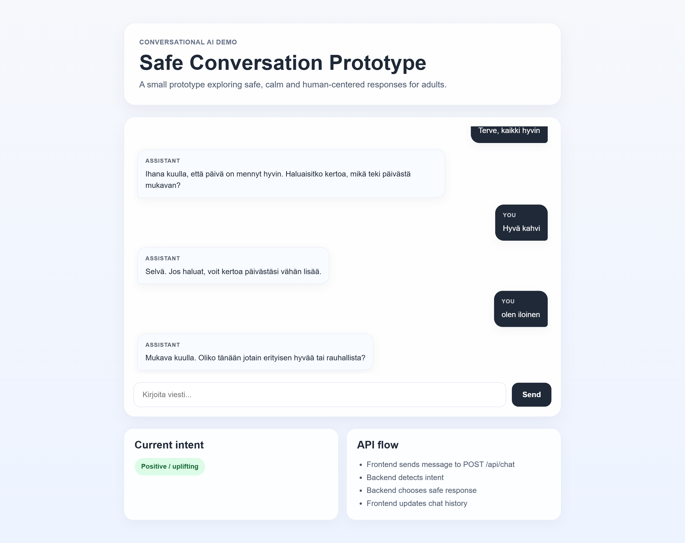
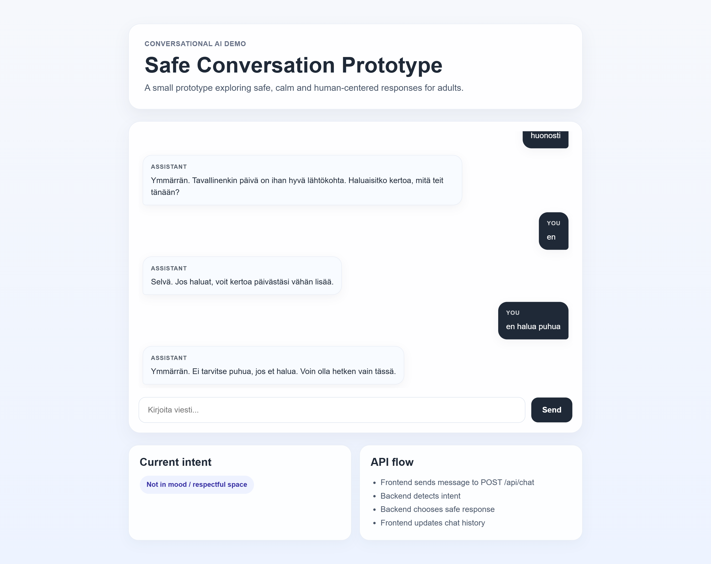
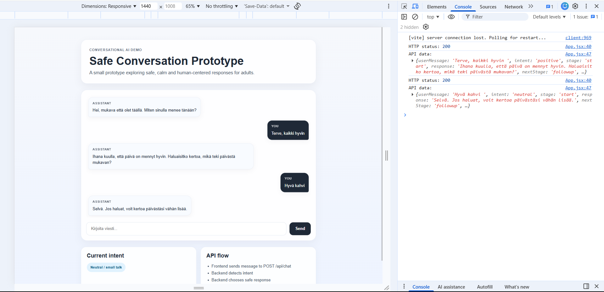

# Safe Conversation Prototype

A small full-stack conversational AI prototype exploring calm, safe and human-centered responses for older adults.

## Screenshot





## Purpose

This prototype was created to explore how a conversational assistant for older adults could respond in a respectful, supportive and non-intrusive way.

The focus is not on complex AI infrastructure, but on product thinking:
- intent detection
- mini-dialog flow
- safe fallback behavior
- supportive tone of voice
- respectful handling of difficult emotional states

## Features

- React frontend with chat-style interface
- Node.js + Express backend API
- Simple intent detection logic
- Mini-dialog state (`start`, `followup`, `closing`)
- Support for multiple user situations:
  - greeting
  - positive
  - neutral
  - loneliness
  - low mood
  - not in mood to talk
  - confusion
  - silence
  - goodbye
- Safe and calm response variations

## Tech Stack

### Frontend
- React
- Vite
- CSS

### Backend
- Node.js
- Express
- CORS

## How it works

1. User sends a message in the chat UI
2. Frontend sends a `POST` request to `/api/chat`
3. Backend detects intent using simple rule-based logic
4. Backend selects a response based on:
   - intent
   - conversation stage
5. Frontend updates chat history and conversation state

## Example flow

User:
`Minulla on vähän yksinäinen olo`

System:
`Ymmärrän. Olen täällä kuuntelemassa. Haluaisitko kertoa, millainen päiväsi on ollut?`

User:
`En halua puhua`

System:
`Ymmärrän. Ei tarvitse puhua, jos et halua. Voin olla hetken vain tässä.`

## Why this prototype

I wanted to explore how conversational AI can be designed not only to respond, but to respond safely and respectfully — especially in situations where the user feels lonely, tired, low, or simply not ready to talk.

## Future improvements

- speech-to-text integration
- text-to-speech integration
- more advanced dialog state handling
- better intent classification
- logging and analytics
- LLM-based response generation with guardrails
- personalized context handling

## Run locally

### 1. Install dependencies
```bash
npm install

2. Start frontend
npm run 

3. Start backend
npm run server